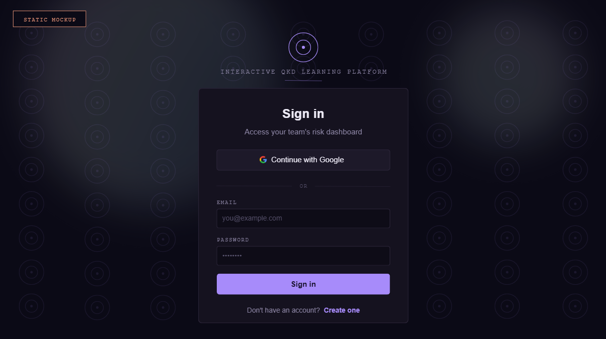
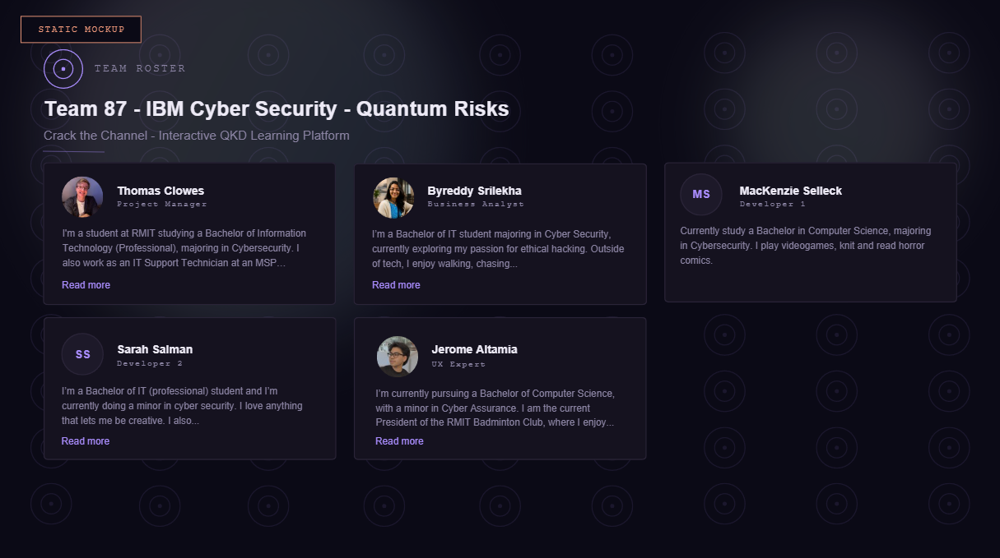

# Task Document

*Design Login Style & Team Page Layout*

| **Team**        | 87, IBM Cyber Security, Quantum Risks                                                                                                                                                           |
|-----------------|-------------------------------------------------------------------------------------------------------------------------------------------------------------------------------------------------|
| **Project**     | “Crack the Channel” - Interactive QKD Learning Platform                                                                                                                                         |
| **Task**        | Produce a mockup/wireframe of the restyled login page and a separate mockup of the team page layout, based on the BA’s requirements document. Both must be visually consistent with each other. |
| **Based on**    | Team Page and Login Styling Requirements, prepared by Srilekha Byreddy (BA), 9 August 2026                                                                                                      |
| **Prepared by** | Jerome Altamia (UX)                                                                                                                                                                             |
| **Status**      | Design mockup for BA review. Implementation has not started.                                                                                                                                    |

## 1. Purpose

This document presents the login page mockup and the team page mockup, produced against the requirements set out in "Team Page and Login Styling Requirements" (prepared by Srilekha Byreddy, 9 August 2026).

These are static design mockups: flat images with no underlying application logic, routing, or authentication behaviour. They exist for design validation before any implementation work begins, consistent with the standard BA, UX, Developer workflow.

## 2. Login Page Mockup

### Design notes

- Dark, security-console theme reflecting the platform’s subject matter (quantum risk and cybersecurity), with a violet accent and an orbital-ring badge and background motif.

- Field labels use a monospace, tracked-out treatment ("EMAIL", "PASSWORD") to read like telemetry rather than a generic form.

- One accent color is used consistently for every interactive element: the primary button, focus states, and links.

- Static image only. No auth logic, validation, or routing is implied or included.

## 3. Team Page Mockup

### Design notes

- Same visual treatment applied to the team roster panel, consistent with the login mockup.

- Shows team name, project name, and all 5 members with photo or initials, name, role, and blurb, per the Team Page Requirements table.

- Missing-photo members (MacKenzie, Sarah) are shown with the initials-avatar fallback.

## 4. Visual Consistency

Both mockups share the same design tokens, so they read as one continuous direction rather than two unrelated screens:

| **Swatch** | **Token**         | **Used for**                                                                                                                    |
|------------|-------------------|---------------------------------------------------------------------------------------------------------------------------------|
| \#0B0A16   | Void / background | Page and panel background on both mockups                                                                                       |
| \#15121F   | Panel             | Card background (login card, team member cards)                                                                                 |
| \#2A2438   | Hairline          | Borders on cards, inputs, and dividers                                                                                          |
| \#A78BFA   | Accent (violet)   | Buttons, focus states, links, the orbital-ring badge and the background motif: one accent color, used identically on both pages |
| \#EDEAF6   | Primary text      | Headings and names                                                                                                              |
| \#8B84A3   | Secondary text    | Subtext, mono field/role labels                                                                                                 |

Typography is shared as well: display headings use a standard sans-serif font, while field labels and role labels both use a monospace font in the same uppercase, tracked-out style.

## 5. Requirements Traceability

Maps each item from the requirements document to how it is addressed across the mockup set.

| **Requirement**                                        | **How it is addressed**                                                                                                                                                                                                              | **Status**           |
|--------------------------------------------------------|--------------------------------------------------------------------------------------------------------------------------------------------------------------------------------------------------------------------------------------|----------------------|
| Team name                                              | Displayed as the page heading inside the team page panel.                                                                                                                                                                            | Covered              |
| Project name                                           | Displayed as subtext directly under the team name.                                                                                                                                                                                   | Covered              |
| Member photo (EC1)                                     | Members without a photo (MacKenzie, Sarah) show an initials avatar in place of a broken or empty image area.                                                                                                                         | Covered              |
| Member photo, different dimensions (EC4)               | All photos sit in a fixed circular frame, so source images of different sizes or aspect ratios render consistently.                                                                                                                  | Covered              |
| Member name or role, unusually long (EC3)              | Not yet demonstrated. Every member in the current set has a normal-length name and role.                                                                                                                                             | Not shown            |
| Member blurb, significantly longer than expected (EC2) | Shown via the "Read more" and "Show less" states: the full blurb expands without breaking the card layout.                                                                                                                           | Covered              |
| Smaller screen sizes (EC5)                             | Shown separately as 9:16 mobile mockups: the team grid collapses to a single column.                                                                                                                                                 | Covered              |
| Invalid or incomplete login input (EC6)                | Shown across several states: invalid email or password on sign in, name too short, invalid email format, password too short, password missing an uppercase letter, password missing a number, and passwords not matching on sign up. | Covered              |
| Direct access without authentication (EC7)             | Not shown as a static screen, since a redirect is a behaviour rather than a look. Addressed separately as an annotated flow mockup showing the blocked attempt and the resulting redirect to sign in.                                | Addressed separately |

## 6. Status and Next Steps

- This document is for BA design validation only.

- No implementation has been started against this design.

- Once the design is approved, implementation is Developer-scope work, not UX.
